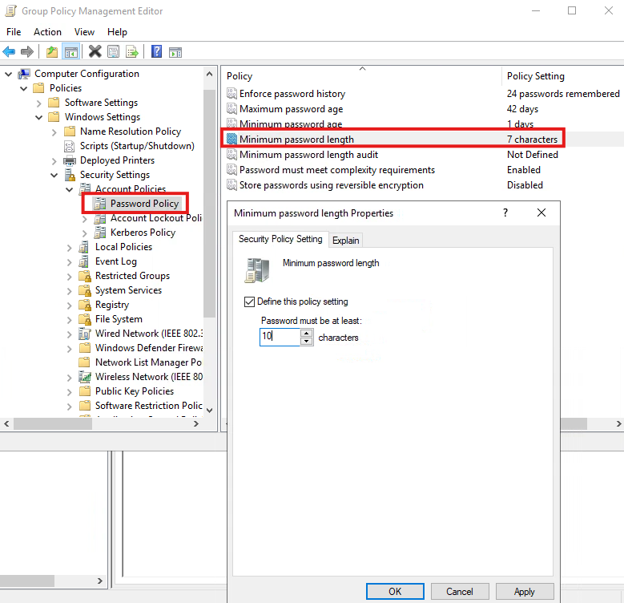
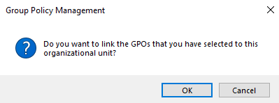

<h1>Windows Active Directory Lab</h1>

This project details my hands-on work with Microsoft Active Directory (AD) and Windows Server, completed through the TryHackMe Active Directory lab. It reflects my foundational abilities in managing users and groups, applying Group Policy Objects (GPOs), and gaining awareness of how core network services such as DNS and DHCP support Active Directory functionality. Through this experience, I gained practical knowledge of enterprise network architecture and account administration, building skills directly applicable to IT support and system administration.

---

<h2>Tools Used</h2>

1. Active Directory Users and Computers (ADUC)
2. Remote Desktop Protocol (RDP)
3. Command Prompt
4. Group Policy Management Editor

---

## Project Explanation

**Using the Active Directory Users and Computers (ADUC) console, I was able to perform the following tasks:**

   
  
   
  

**User Lifecycle Management** – Given the organizational chart + contradictory AD displayed above, I was able to practice disabling and deleting Organizational Units (OU) and accounts to improve security during offboarding or inactivity.
  

  

**Group Management** – Created security groups with descriptive names and assigned users to manage permissions and resource access.
  

  

**User Delegation** — Assigned a user from the IT OU the permission to reset passwords for all users in the Sales department, demonstrating controlled administrative access.
  

  
  

**Helpdesk Simulation** — Logged in via RDP as the delegated account to perform a password reset, replicating a common IT support workflow.

  
  

  
**Group Policy Objects (GPOs)** — Reviewed existing policies like password rules, software restrictions, and user rights assignment to understand configuration, then created and linked a custom GPO to the correct OU for targeted enforcement.

---
## Conclusion

This project provided me with direct experience in how Active Directory structures, policies, and permissions support day-to-day IT operations. The practical knowledge I gained proved highly valuable, strengthening my technical skills and deepening my understanding of secure user and resource management.
