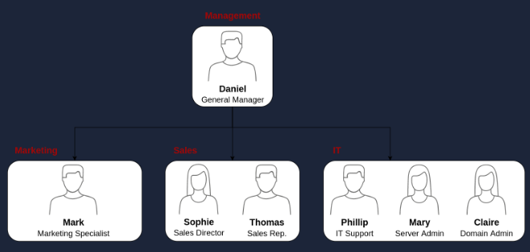
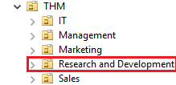
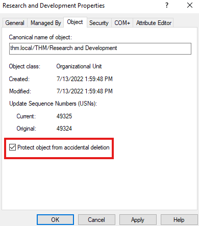

<h1> Windows Active Directory Lab </h1>

This project details my hands-on work with Microsoft Active Directory (AD) and Windows Server, completed through the TryHackMe Active Directory lab. It reflects my foundational abilities in managing users and groups, applying Group Policy Objects (GPOs), and gaining awareness of how core network services such as DNS and DHCP support Active Directory functionality. Through this experience, I gained practical knowledge of enterprise network architecture and account administration, building skills directly applicable to IT support and system administration.

---

## Project Explanation

Using the Active Directory Users and Computers (ADUC) console, I was able to perform the following tasks:

---

   

**User Lifecycle Management:** Given the organizational chart and contradictory AD displayed above, I was able to practice disabling and deleting the Organizational Units (OU) and accounts to improve security during offboarding or inactivity.
